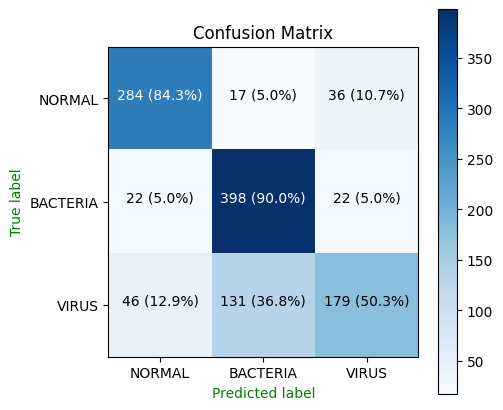
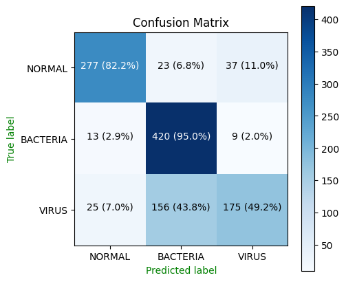
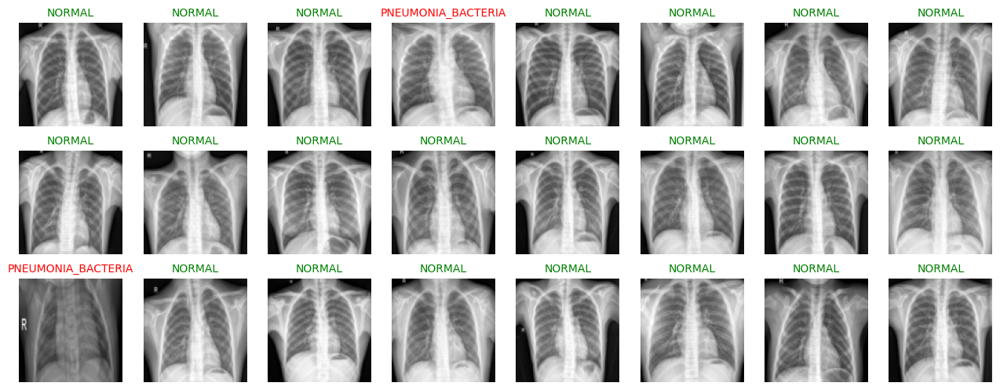
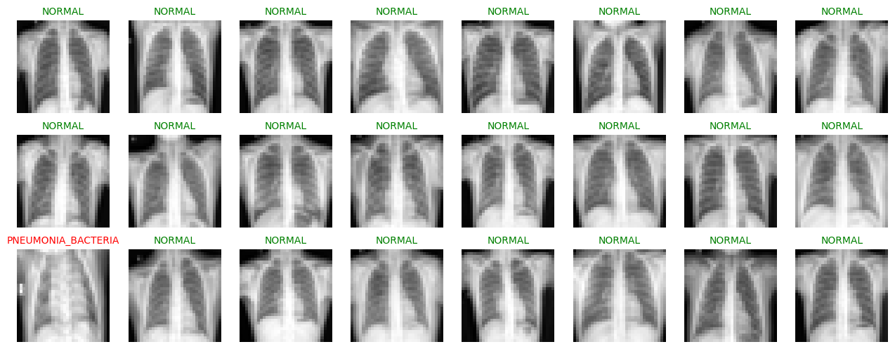

### Pneumonia Classification

This is a simple `REST` api that is served to classify `pneumonia` given an X-ray image of a chest of a human beings. The following are expected results when the model does it's classification.

1. pneumonia bacteria
2. pneumonia virus
3. normal

<p align="center" with="100%">

</p>

### Starting the server

To run this server and make prediction on your own images follow the following steps

0. clone this repository by running the following command:

```shell
git clone https://github.com/CrispenGari/pneumonia-infection.git
```

1. Navigate to the folder `pneumonia-infection` by running the following command:

```shell
cd pneumonia-infection
```

2. create a virtual environment and activate it, you can create a virtual environment in may ways for example on windows you can create a virtual environment by running the following command:

```shell
virtualenv venv && .\venv\Scripts\activate
```

3. run the following command to install packages

```shell
pip install -r requirements.txt
```

4. navigate to the folder where the `app.py` file is located and run

```shell
cd app
# then
python app.py
```

### Models

We have 2 models which are specified by versions and have different model architecture.

1. **M**ulti **L**ayer **P**erceptron **(MLP)** - `v0`
2. **LeNET** - `v1`

### 1. MLP architecture

Our simple **M**ulti **L**ayer **P**erceptron **(MLP)** architecture to do the categorical image classification on `chest-x-ray` looks simply as follows:

```py
class MLP(nn.Module):
    def __init__(self, input_dim, output_dim, dropout=.5):
        super(MLP, self).__init__()
        self.input_fc = nn.Linear(input_dim, 250)
        self.hidden_fc = nn.Linear(250, 100)
        self.output_fc = nn.Linear(100, output_dim)
        self.dropout = nn.Dropout(dropout)

    def forward(self, x):
        batch_size = x.shape[0]
        x = x.view(batch_size, -1)
        x = F.relu(self.input_fc(x))
        x = self.dropout(x)
        x = F.relu(self.hidden_fc(x))
        x = self.dropout(x)
        outputs = self.output_fc(x)
        return outputs, x
```

> All images are transformed to `grayscale`.

### 2. LeNET architecture

The **`LeNet`** architecture to do the categorical image classification on `chest-x-ray` looks simply as follows:

```py
class LeNet(nn.Module):
  def __init__(self, output_dim):
    super(LeNet, self).__init__()
    self.maxpool2d = nn.MaxPool2d(2)
    self.relu = nn.ReLU()
    self.convs = nn.Sequential(
        nn.Conv2d(
          in_channels=1,
          out_channels=6,
          kernel_size =5
        ),
        nn.MaxPool2d(2),
        nn.ReLU(),
        nn.Conv2d(
            in_channels=6,
            out_channels=16,
            kernel_size = 5
        ),
        nn.MaxPool2d(2),
        nn.ReLU()
    )
    self.classifier = nn.Sequential(
        nn.Linear(16 * 5 * 5, 120),
        nn.ReLU(),
        nn.Linear(120, 84),
        nn.ReLU(),
        nn.Linear(84, output_dim)
    )
  def forward(self, x):
    # x = [batch size, 1, 32, 32]
    x = self.convs(x)
    # x = [batch_size, 16, 5, 5]
    x = x.view(x.shape[0], -1) # x = [batch size, 16*5*5]
    x = self.classifier(x)
    return x
```

### Model Metrics

First let's have a look on how many examples our dataset was having in each set. We had `3` sets which are `train`, `validation` and `test`. In the following table we will see how many examples for each set was used to train these models.

<table border="1">
    <thead>
      <tr>
        <th>ARCHITECTURE</th>
        <th>TRAIN EXAMPLES</th>
        <th>VALIDATION EXAMPLES</th>
        <th>TEST EXAMPLES</th>
        <th>TOTAL EXAMPLES</th>
      </tr>
    </thead>
    <tbody>
      <tr>
        <td>MLP</td>
        <td>5,442</td>
        <td>1,135</td>
        <td>1,135</td>
        <td>7,712</td>
      </tr>
      <tr>
        <td>LeNet</td>
        <td>5,442</td>
        <td>1,135</td>
        <td>1,135</td>
        <td>7,712</td>
      </tr>
    </tbody>
  </table>

All models were trained for `20` epochs and the training the following table shows the training summary for each model architecture.

<table border="1">
    <thead>
      <tr>
        <th>ARCHITECTURE</th>
        <th>TOTAL EPOCHS</th>
        <th>LAST SAVED EPOCH </th>
        <th>TOTAL TRAINING TIME</th>
      </tr>
    </thead>
    <tbody>
      <tr>
        <td>MLP</td>
        <td>20</td>
        <td>20</td>
        <td>1:04:01.61</td>
      </tr>
      <tr>
        <td>LeNet</td>
        <td>20</td>
        <td>20</td>
        <td>1:04:01.61</td>
      </tr>
    </tbody>
</table>

These models have different model parameters, in the following table we are going to show the model parameters for each architecture.

<table border="1">
    <thead>
      <tr>
        <th>ARCHITECTURE</th>
        <th>TOTAL PARAMETERS</th>
        <th>TRAINABLE PARAMETERS</th>
      </tr>
    </thead>
    <tbody>
      <tr>
        <td>MLP</td>
        <td>2,329,653</td>
        <td>2,329,653</td>
      </tr>
      <tr>
        <td>LeNet</td>
        <td>61,111</td>
        <td>61,111</td>
      </tr>
    </tbody>
</table>

### Models Evaluation Metrics

In the following table we are going to show the best model's `train`, `evaluation` and `test` `accuracy` for each model version.

<table border="1">
    <thead>
      <tr>
        <th>MODEL NAME</th>
        <th>MODEL ARCHITECTURE</th>
        <th>MODEL DESCRIPTION</th>
        <th>MODEL VERSION</th>
        <th>TEST ACCURACY</th>
        <th>VALIDATION ACCURACY</th>
        <th>TRAIN ACCURACY</th>
         <th>TEST LOSS</th>
        <th>VALIDATION LOSS</th>
        <th>TRAIN LOSS</th>
      </tr>
    </thead>
    <tbody>
      <tr>
        <td>pneumonia_mlp.pt</td>
        <td>MLP</td>
        <td>pneumonia classification using Multi Layer Perceprton (MLP)</td>
        <td>v0</td>
        <td>74.65%</td>
        <td>74.65%</td>
        <td>73.89%</td>
        <td>0.600</td>
        <td>0.600</td>
        <td>0.602</td>
      </tr>
      <tr>
        <td>pneunomia_lenet.pt</td>
        <td>LeNET</td>
        <td>pneumonia classification model using the modified LeNet architecture.</td>
        <td>v1</td>
        <td>76.51%</td>
        <td>76.51%</td>
        <td>78.49%</td>
        <td>0.551</td>
        <td>0.551</td>
        <td>0.505</td>
      </tr>
    </tbody>
</table>

Next, we are going to show the model evaluation metrics using the whole `test` data which contains `1,135` examples of images mapped to their labels.

### confusion matrix (`CM`)

1. `MLP` (v0)

The following visualization is of a confusion matrix based on the `MLP` model architecture which was tested using `1,135` images on the `test` dataset.

<p align="center" with="100%">
</p>

2. `LeNet` (v1)
   The following visualization is of a confusion matrix based on the `LeNet` model architecture which was tested using `1,135` images on the `test` dataset.

<p align="center" with="100%">
</p>

### classification report (`CR`)

In this section we are going to show the summary of the `classification report` based on the best saved model of the best model.

1. `MLP` (v0)

This is the `mlp` model's `cr`.

<table border="1">
    <thead>
      <tr>
        <th>#</th>
        <th>precision</th>
        <th>recall</th>
        <th>f1-score</th>
        <th>support</th>
      </tr>
    </thead>
    <tbody>
      <tr>
        <td>micro avg</td>
        <td>0.76</td>
        <td>0.75</td>
        <td>0.74</td>
        <td>435669</td>
      </tr>
      <tr>
        <td>accuracy</td>
        <td></td>
        <td></td>
        <td>0.75</td>
        <td>435669</td>
      </tr>
      <tr>
        <td>weighted avg</td>
        <td>0.75</td>
        <td>0.76</td>
        <td>0.74</td>
        <td>435669</td>
      </tr>
    </tbody>
  </table>

2. `LeNet` (v1)

This is the `LeNet` model's `cr`.

<table border="1">
    <thead>
      <tr>
        <th>#</th>
        <th>precision</th>
        <th>recall</th>
        <th>f1-score</th>
        <th>support</th>
      </tr>
    </thead>
    <tbody>
      <tr>
        <td>micro avg</td>
        <td>0.78</td>
        <td>0.77</td>
        <td>0.76</td>
        <td>435669</td>
      </tr>
      <tr>
        <td>accuracy</td>
        <td>100%</td>
        <td></td>
        <td>0.77</td>
        <td>435669</td>
      </tr>
      <tr>
        <td>weighted avg</td>
        <td>0.77</td>
        <td>0.78</td>
        <td>0.76</td>
        <td>435669</td>
      </tr>
    </tbody>
  </table>

### Pneumonia classification

During model evaluation both models were tested to see if they were classifying images correctly. A sample of `24` images was taken from the first batch of test data and here are the visual results of the classification for each model.

1. `MLP` (v0)

<p align="center" with="100%">
</p>

2. `LeNet` (v1)

<p align="center" with="100%">
</p>

> The images that were marked their labels in color `RED` are the ones the model if misclassifying.

### REST API

This project exposes a `REST` api that is running on port `3001` which can be configured by changing the `AppConfig` in the `app/app.py` file that looks as follows:

```py
class AppConfig:
    PORT = 3001
    DEBUG = False
```

The server exposes two model versions the `v0` which is the `mlp` model and `v1` which is the `lenet` architecture. When making a request to the server you need to specify the model version that you want to use to make predictions. The `URL` looks as follows:

```shell
http://localhost:3001/api/<MODEL_VERSION>/pneumonia
```

The `MODEL_VERSION` an be either `v0` or `v1`. Here are the example of url's that can be used to make request to the server using these model versions.

```shell
http://localhost:3001/api/v0/pneumonia - mlp-model
http://localhost:3001/api/v1/pneumonia - lenet-model
```

> Note that all the request should be sent to the server using the `POST` method.

### Expected Response

The expected response at `http://localhost:3001/api/v0/pneumonia` with a file `image` of the right format will yield the following `json` response to the client.

```json
{
  "modelVersion": "v0",
  "predictions": {
    "class_label": "NORMAL",
    "label": 0,
    "meta": {
      "description": "given a medical chest-x-ray image of a human being we are going to classify weather a person have pneumonia virus, pneumonia bacteria or none of those(normal).",
      "language": "python",
      "library": "pytorch",
      "main": "computer vision (cv)",
      "programmer": "@crispengari"
    },
    "predictions": [
      {
        "class_label": "NORMAL",
        "label": 0,
        "probability": 0.9700000286102295
      },
      {
        "class_label": "PNEUMONIA BACTERIA",
        "label": 1,
        "probability": 0.009999999776482582
      },
      {
        "class_label": "PNEUMONIA VIRAL",
        "label": 2,
        "probability": 0.029999999329447746
      }
    ],
    "probability": 0.9700000286102295
  },
  "success": true
}
```

### Using `cURL`

Make sure that you have the image named `normal.jpeg` in the current folder that you are running your `cmd` otherwise you have to provide an absolute or relative path to the image.

> To make a `curl` `POST` request at `http://localhost:3001/api/v0/pneumonia` with the file `normal.jpeg` we run the following command.

```shell
cURL -X POST -F image=@normal.jpeg http://127.0.0.1:3001/api/v0/pneumonia
```

### Using Postman client

To make this request with postman we do it as follows:

1. Change the request method to `POST`
2. Click on `form-data`
3. Select type to be `file` on the `KEY` attribute
4. For the `KEY` type `image` and select the image you want to predict under `value`
5. Click send

If everything went well you will get the following response depending on the face you have selected:

```json
{
  "modelVersion": "v0",
  "predictions": {
    "class_label": "NORMAL",
    "label": 0,
    "meta": {
      "description": "given a medical chest-x-ray image of a human being we are going to classify weather a person have pneumonia virus, pneumonia bacteria or none of those(normal).",
      "language": "python",
      "library": "pytorch",
      "main": "computer vision (cv)",
      "programmer": "@crispengari"
    },
    "predictions": [
      {
        "class_label": "NORMAL",
        "label": 0,
        "probability": 0.9700000286102295
      },
      {
        "class_label": "PNEUMONIA BACTERIA",
        "label": 1,
        "probability": 0.009999999776482582
      },
      {
        "class_label": "PNEUMONIA VIRAL",
        "label": 2,
        "probability": 0.029999999329447746
      }
    ],
    "probability": 0.9700000286102295
  },
  "success": true
}
```

### Using JavaScript `fetch` api.

1. First you need to get the input from `html`
2. Create a `formData` object
3. make a POST requests

```js
const input = document.getElementById("input").files[0];
let formData = new FormData();
formData.append("image", input);
fetch("http://127.0.0.1:3001/api/v0/pneumonia", {
  method: "POST",
  body: formData,
})
  .then((res) => res.json())
  .then((data) => console.log(data));
```

If everything went well you will be able to get expected response.

```json
{
  "modelVersion": "v0",
  "predictions": {
    "class_label": "NORMAL",
    "label": 0,
    "meta": {
      "description": "given a medical chest-x-ray image of a human being we are going to classify weather a person have pneumonia virus, pneumonia bacteria or none of those(normal).",
      "language": "python",
      "library": "pytorch",
      "main": "computer vision (cv)",
      "programmer": "@crispengari"
    },
    "predictions": [
      {
        "class_label": "NORMAL",
        "label": 0,
        "probability": 0.9700000286102295
      },
      {
        "class_label": "PNEUMONIA BACTERIA",
        "label": 1,
        "probability": 0.009999999776482582
      },
      {
        "class_label": "PNEUMONIA VIRAL",
        "label": 2,
        "probability": 0.029999999329447746
      }
    ],
    "probability": 0.9700000286102295
  },
  "success": true
}
```

### Notebooks

The `ipynb` notebook that i used for training the models and saving an `.pt` file was can be found in respective links bellow:

1. [Model Training And Saving - `MLP`](https://github.com/CrispenGari/cv-torch/blob/main/01-PNEUMONIA-CLASSIFICATION/01_MLP_Pneumonia.ipynb)
2. [Model Training And Saving - `LeNet`](https://github.com/CrispenGari/cv-torch/blob/main/01-PNEUMONIA-CLASSIFICATION/02_LeNet_Pneumonia.ipynb)
